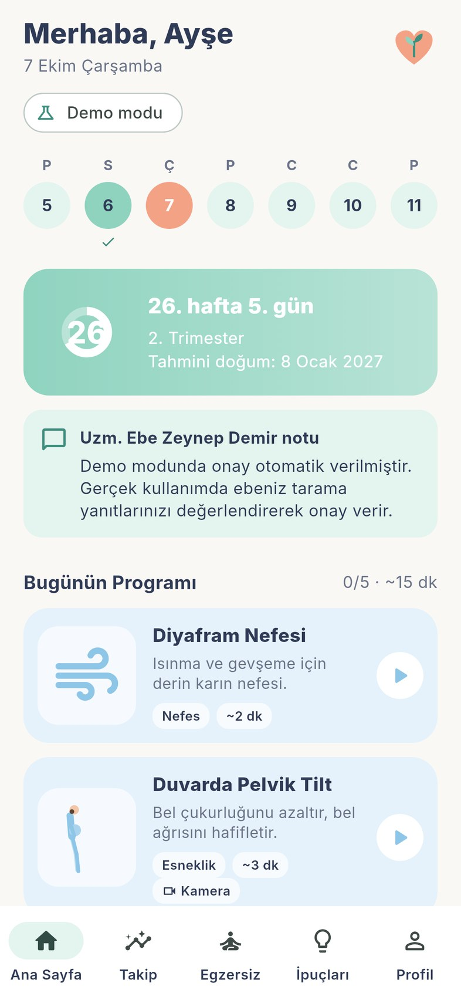
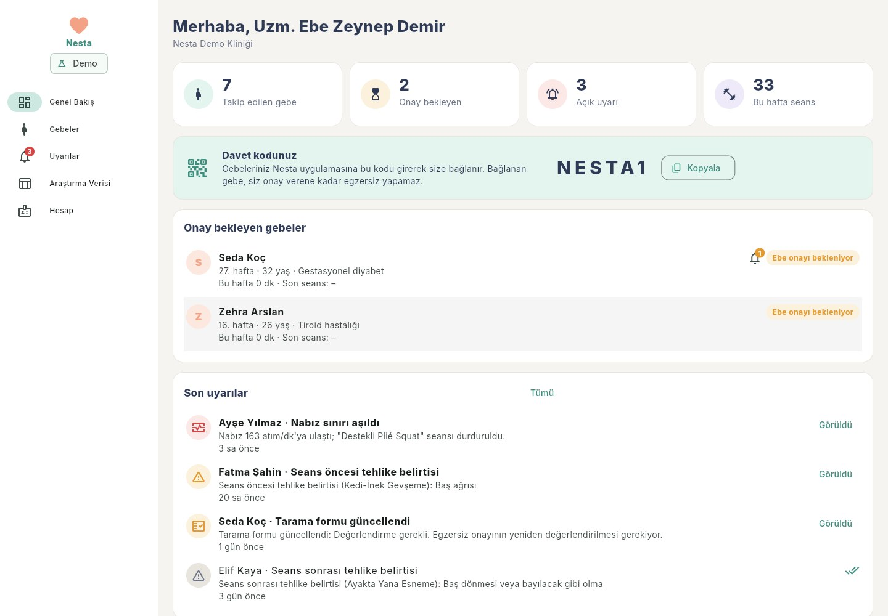

# Nesta

**Riskli gebeliklerde güvenli egzersiz yönetimi için yapay zekâ destekli mobil uygulama**

Nesta, riskli gebeliği olan kadınların ev ortamında ebe/hekim onayıyla güvenli
egzersiz yapmasını destekler. Telefon kamerası üzerinden cihaz içinde çalışan
poz tahmini ile postürü izler ve hatalı harekette Türkçe sesli uyarı verir;
akıllı saatten nabzı takip eder; her seansta tehlike belirtilerini sorgular ve
gerektiğinde egzersizi durdurarak ebeye bildirim gönderir.

| Gebe uygulaması | Ebe paneli |
|---|---|
|  |  |

## Bileşenler

| Klasör | İçerik |
|---|---|
| `apps/mobile` | Gebe uygulaması (Flutter; Android 8.0+, iOS 15.5+) |
| `apps/panel` | Ebe/hekim web paneli (Flutter web) |
| `packages/nesta_core` | Ortak iş mantığı: egzersiz kütüphanesi, postür kuralları, güvenlik eşikleri, modeller |
| `firebase` | Firestore güvenlik kuralları, indeksler ve kural testleri |
| `docs` | Kurulum, teknik belge, egzersiz kataloğu, veri sözlüğü, proje raporu |

## Özellikler

**Gebe uygulaması**
- KVKK aydınlatma metni ve katmanlı açık rıza (sağlık verisi zorunlu, araştırma isteğe bağlı)
- Gebelik profili: son adet veya tahmini doğum tarihinden gebelik haftası ve trimester
- ACOG (2020) kontrendikasyon taraması: mutlak kontrendikasyonda program açılmaz
- Ebe davet koduyla bağlanma; **program yalnızca ebe onayından sonra açılır**
- Trimestere ve ebenin kısıtlamalarına göre günlük program (9 egzersiz)
- Kamera ile cihaz üzerinde poz tahmini (Google ML Kit), postür kuralları, tekrar sayımı, Türkçe sesli koç; görüntü kaydedilmez ve gönderilmez
- Akıllı saat nabzı (Health Connect / Apple Sağlık), Kanada (2019) kılavuzu hedef aralıkları, eşik aşımında uyarı ve otomatik durdurma
- Beta bloker kullananlar için konuşma testi ve Borg zorlanma ölçeği
- Seans öncesi, sırası ("Kendimi iyi hissetmiyorum") ve sonrası tehlike belirtisi sorgusu; ebeye anlık uyarı
- Takip takvimi, haftalık aktivite grafiği, seans geçmişi, ipuçları
- Verileri indirme (CSV/JSON) ve hesabı silme
- Araştırma modu: teknik doğrulama ve veri seti için kare bazında eklem/ölçüm kaydı

**Ebe paneli**
- Davet kodu, onay bekleyen gebeler, tarama yanıtları
- Egzersiz onayı, gebeye not ve egzersiz bazında kısıtlama
- Gebe bazında aktivite, form puanı, nabız, zorlanma ve seans tablosu
- Acil öncelikli uyarı kutusu
- Araştırma verisinin anonim CSV olarak dışa aktarımı (yalnızca araştırma onamı verenler)

## Hızlı başlangıç (demo modu)

Firebase kurulmadan her iki uygulama da **demo modunda** çalışır: gebe
uygulamasında veriler telefonda saklanır ve `NESTA1` davet koduyla örnek ebeye
bağlanılır; ebe paneli örnek gebeler ve seanslarla açılır.

```bash
# Gebe uygulaması (Android cihaz/emülatör bağlıyken)
cd apps/mobile && flutter run

# Ebe paneli
cd apps/panel && flutter run -d chrome
```

Gerçek kullanım için Firebase kurulumu: [docs/KURULUM.md](docs/KURULUM.md).

Her `master` gönderiminde GitHub Actions tüm testleri çalıştırır ve
**kurulabilir Android APK** ile panelin web derlemesini *Artifacts* olarak üretir.

## Testler

```bash
cd packages/nesta_core && dart test      # 67 test: kurallar, eşikler, modeller
cd apps/mobile && flutter test           # seans akışı, uçtan uca kurulum, küçük ekran
cd apps/panel && flutter test            # panel akışı (masaüstü/tablet/telefon), anonimleştirme
cd firebase && npm ci && npm test        # 26 Firestore güvenlik kuralı testi (emülatör)
```

## Belgeler

- [Kurulum ve yayın](docs/KURULUM.md)
- [Teknik belge: mimari, algoritma, güvenlik](docs/TEKNIK.md)
- [Egzersiz kataloğu ve postür kuralları](docs/EGZERSIZ_KATALOGU.md) (uzman paneli için)
- [Teknik doğrulama protokolü](docs/DOGRULAMA_PROTOKOLU.md)
- [Araştırma verisi sözlüğü](docs/VERI_SOZLUGU.md)
- [Proje raporu (revize)](docs/Nesta_Proje_Raporu_Revize.docx)

## Önemli not

Nesta tanı koymaz ve ebe/hekim kontrolünün yerine geçmez. Egzersiz eşikleri
literatüre dayalı başlangıç değerleridir; uzman paneli değerlendirmesi ve
teknik doğrulama ile güncellenmelidir. Uygulamanın yaygın kullanıma sunulmadan
önce tıbbi cihaz yazılımı mevzuatı kapsamında değerlendirilmesi gerekir.
